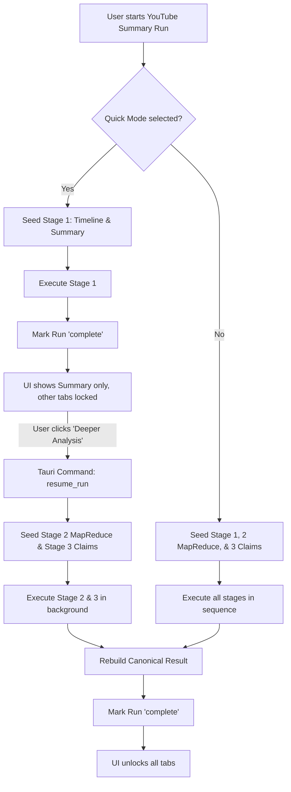

# Specification: Progressive YouTube Summary Multi-Stage Pipeline

This document defines the finalized specification for refactoring the `youtube_summary` prompt pack to support progressive in-place run resumption, MapReduce detailed extraction, and locked tab indicators in the UI.

---

## 1. Architectural Flow

The pipeline uses **Variant A (In-place Run Resumption)**. The execution workflow is as follows:



---

## 2. Pipeline Stages & MapReduce Detail

### Stage 1: Timeline & Summary (`youtube_summary/narrative`)
* **Input:** Raw video transcript.
* **Output:**
  * `summary_text`: Readable narrative summary (2-4 paragraphs).
  * `timeline`: Array of segments:
    ```json
    [
      { "segment_id": "seg_1", "start_seconds": 0, "end_seconds": 180, "title": "Intro" },
      { "segment_id": "seg_2", "start_seconds": 180, "end_seconds": 600, "title": "Main Topic" }
    ]
    ```

### Stage 2: MapReduce Details Extraction (`youtube_summary/segment_details`)
For each segment generated in Stage 1, a separate lightweight LLM call is triggered:
* **Input:** Transcript slice (matching segment start/end timestamps) + Segment title.
* **Prompt Instructions:** Focus exclusively on the details covered in this specific time window.
* **Output:**
  * `key_points`: Array of points.
  * `quotes`: Direct quotes from this slice.
  * `action_items`: Actionable items from this slice.
  * `open_questions`: Questions raised in this slice.
* **Consolidation:** The backend automatically merges the array outputs of all segments into a single unified detail sheet for the video.

### Stage 3: Analytical Reasoning (`youtube_summary/claims`)
* **Input:** Raw transcript + Consolidated key details from Stage 2.
* **Output:**
  * `claims`: Major assertions of fact.
  * `evidence`: Proof/fragments from the transcript linked to each claim.

### Stage 4: Synthesis (`youtube_summary/synthesis`)
* **Input:** Combined narrative, claims, and details of all videos in the project run.
* **Output:** Cross-video themes, contradictions, common claims.

---

## 3. Database Schema & State Transitions

### Stage Lifecycle Statuses
We leverage existing table `prompt_pack_stage_runs`:
* When starting in **Quick Mode**:
  * `prompt_pack_stage_runs` contains only one row: `'youtube_summary/narrative'` (`stage_status = 'pending'`).
* When transitioning to **Full Mode**:
  * We insert rows for `'youtube_summary/segment_details'` (or individual runs per segment) and `'youtube_summary/claims'` with `stage_status = 'pending'`.
  * Set `prompt_pack_runs.run_status = 'running'`.
  * Start the background execution task.

---

## 4. Frontend UI Specification

### Tab Indicators
In Svelte (e.g. `ProjectRunReportPanel.svelte`), the tabs for **Timeline, Claims, Evidence, Action Items, Open Questions** are displayed even in Quick Mode, but with visual indicators:
1. **Disabled Style:** The tab headers have a padlock icon (🔒) or are slightly greyed out.
2. **Placeholder View:** Clicking on a locked tab shows a placeholder box:
   > ### 🔒 Detailed Analysis Pending
   > To inspect timeline segments, factual claims, and exact quotes, run the deep extraction process.
   > 
   > **[⚡ Run Detailed Analysis]** (Button)
3. **Trigger Action:** Clicking the button calls `tauri::invoke("resume_prompt_pack_run", { runId })`, changes the local UI state to *loading/running*, and listens to standard event emissions.
